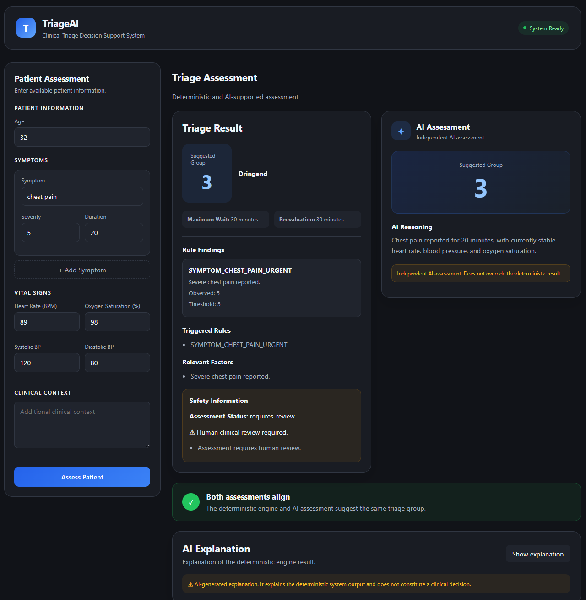
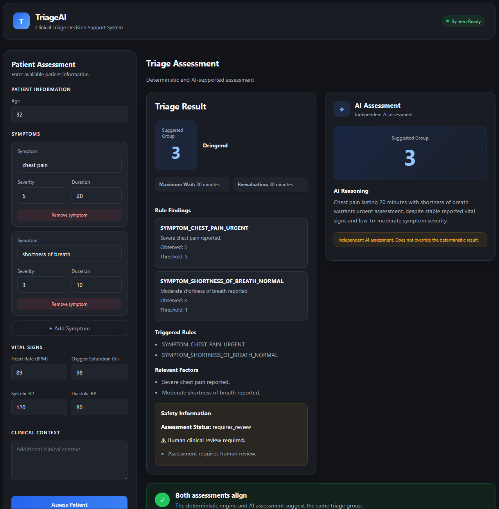
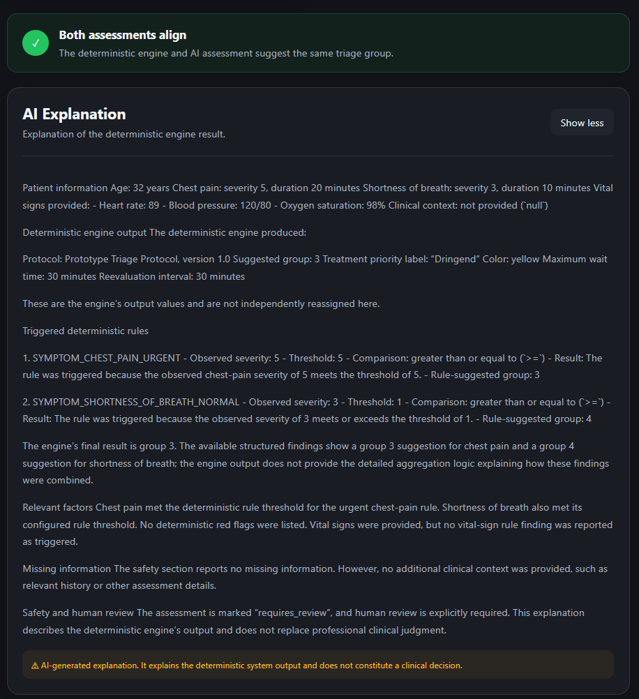
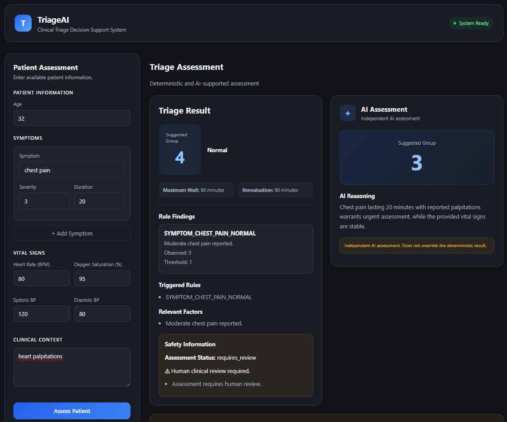
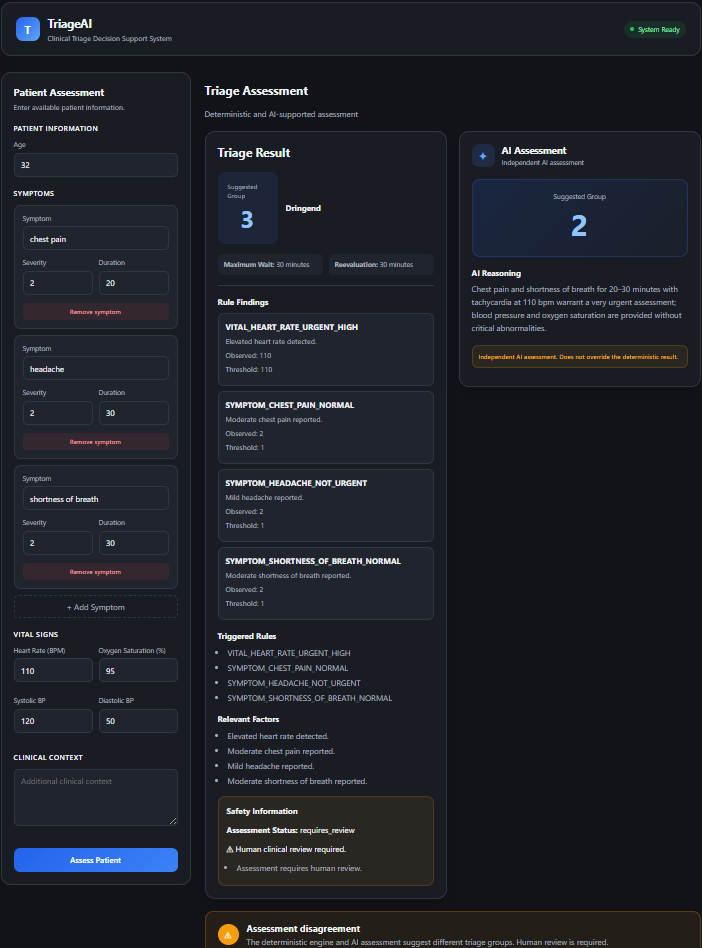
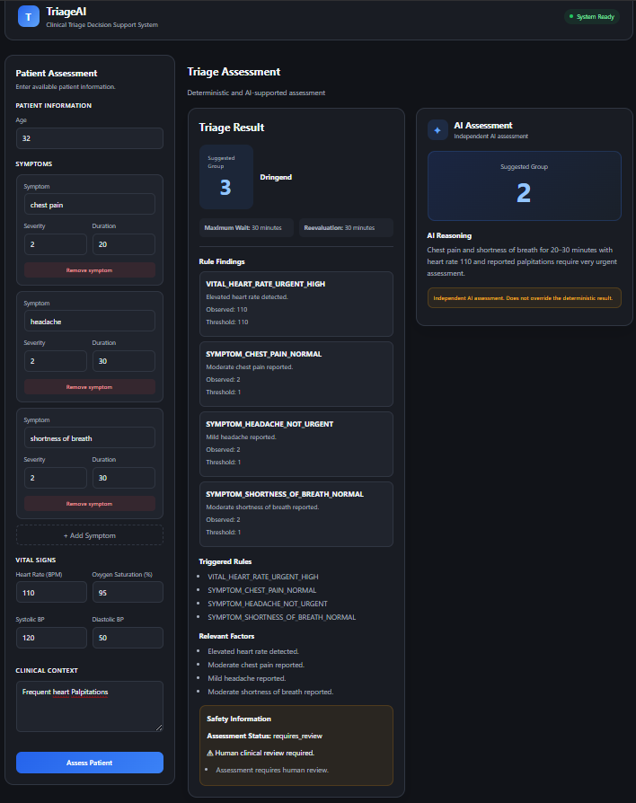
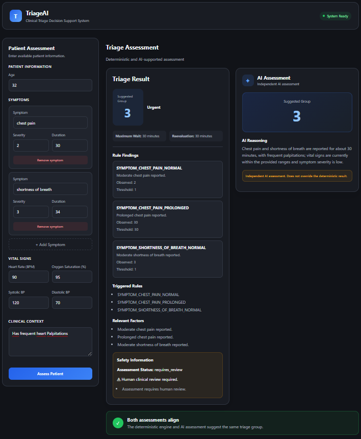

# 🏥 TriageAI

> **An explainable clinical triage decision-support prototype combining a deterministic rule-based triage engine with a separate AI-assisted assessment.**

Built for the **Munich Hackathon 2026**.

---

## ⚠️ Important Disclaimer

TriageAI is a **hackathon prototype and clinical decision-support concept**.

It is **not a medical device** and must not be used as a replacement for professional medical judgment.

The system:

- Does not diagnose patients
- Does not prescribe treatment
- Does not autonomously make clinical decisions
- Does not replace a triage nurse or physician
- Does not guarantee compliance with the official Manchester Triage System

All results require **human clinical review**.

---

# 🎯 Problem Statement

Emergency departments can become overloaded when patients with different levels of urgency arrive at the same time.

Triage nurses must quickly evaluate information such as:

- Symptoms
- Symptom severity
- Symptom duration
- Vital signs
- Patient age
- Clinical context

This process must be performed consistently, often under significant time pressure.

TriageAI explores whether structured patient input, deterministic and explainable triage logic, and an additional AI perspective can support a faster and more transparent triage workflow.

The system receives structured patient information and produces a **suggested triage priority with information explaining how that result was reached**.

---

# 🧠 Project Goal

TriageAI currently combines two distinct approaches:

1. **A deterministic rule-based triage engine**
2. **A separate AI-assisted assessment and explanation component**

The most important architectural principle of the project is:

> **The AI does not determine or override the deterministic engine's assessment.**

The deterministic engine is the primary decision-support component.

The AI is intentionally kept separate and serves as an additional perspective.

This separation is important for several reasons:

- The deterministic result is reproducible
- Triggered rules can be inspected
- The decision path can be tested
- AI output cannot silently alter the engine result
- AI may surface an additional concern that is not yet covered by the current deterministic rule set

The long-term priority of the project is therefore to continue improving the **deterministic triage engine and rule coverage**.

The AI is not intended to replace that work.

---

# ✨ Current Features

## Backend

- FastAPI REST API
- Pydantic-based structured data validation
- Structured patient data
- Deterministic triage engine
- Vital-sign evaluation
- Symptom evaluation
- Symptom severity evaluation
- Symptom duration evaluation
- Rule findings
- Explainable deterministic results
- Protocol name and version information
- Separate AI-assisted severity assessment
- AI-generated reasoning
- AI-generated explanation functionality

## Frontend

- React
- Vite
- Structured patient input form
- Dynamic symptom input
- Vital-sign input
- Clinical-context input
- FastAPI integration
- Deterministic triage result display
- AI assessment display
- AI explanation display
- Comparison between deterministic and AI assessments
- Modern card-based interface
- Expandable information sections

---

# 🚀 Quick Start

The easiest way to run TriageAI is with Docker.

## Prerequisites

You need:

- Docker Desktop
- An OpenAI API key for the AI-assisted functionality

Make sure Docker Desktop is installed and running.

---

## 1. Clone the Repository

```bash
git clone https://github.com/tobichie/TriageAI.git
cd TriageAI
```

---

## 2. Create the Environment File

Create a `.env` file inside the `TriageAI` directory:

```text
TriageAI/
├── .env
│
├── backend/
│   ├── Dockerfile
│   └── ...
│
├── frontend/
│   ├── Dockerfile
│   └── ...
│
└── docker-compose.yml
```

Add your OpenAI API key to `backend/.env`:

```env
OPENAI_API_KEY=your_api_key_here
```

> ⚠️ Never commit your `.env` file or API key to Git.

---

## 3. Start TriageAI

From the **TriageAI root directory**, run:

```bash
docker compose up -d --build
```

Docker will build and start the frontend and backend containers.

---

## 4. Check the Containers

To verify that the containers are running:

```bash
docker compose ps
```

---

## 5. Open TriageAI

Open the frontend URL configured in `docker-compose.yml` in your browser.

---

## Stopping TriageAI

To stop the application:

```bash
docker compose down
```

---

## Updating TriageAI

After pulling new changes:

```bash
git pull
docker compose up -d --build
```

---

## Viewing Logs

View all container logs:

```bash
docker compose logs
```

Follow logs in real time:

```bash
docker compose logs -f
```

View logs for a specific service:

```bash
docker compose logs -f backend
```

or:

```bash
docker compose logs -f frontend
```

# 🏗️ Architecture

The high-level architecture of TriageAI is:

```text
                         ┌──────────────────┐
                         │   TRIAGE NURSE   │
                         └────────┬─────────┘
                                  │
                                  ▼
                    ┌─────────────────────┐
                    │ STRUCTURED PATIENT  │
                    │ DATA                │
                    │                     │
                    │ • Symptoms          │
                    │ • Vital signs       │
                    │ • Age               │
                    │ • Clinical context  │
                    └──────────┬──────────┘
                               │
                               ▼
                    ┌─────────────────────┐
                    │  PYDANTIC VALIDATION│
                    └──────────┬──────────┘
                               │
                               ▼
              ┌────────────────┴────────────────┐
              │                                 │
              ▼                                 ▼

     ┌─────────────────────┐         ┌─────────────────────┐
     │ DETERMINISTIC       │         │ AI COMPONENT        │
     │ TRIAGE ENGINE       │         │                     │
     │                     │         │ Separate assessment │
     │ • Vital rules       │         │ and reasoning       │
     │ • Symptom rules     │         │                     │
     │ • Severity rules    │         └──────────┬──────────┘
     │ • Duration rules    │                    │
     │ • Rule findings     │                    │
     └──────────┬──────────┘                    │
                │                               │
                ▼                               ▼

     Deterministic Result                 AI Assessment

                │                               │
                └──────────────┬────────────────┘
                               │
                               ▼
                    ┌─────────────────────┐
                    │ FRONTEND            │
                    │                     │
                    │ • Engine result     │
                    │ • Triggered rules   │
                    │ • AI assessment     │
                    │ • AI explanation    │
                    │ • Comparison        │
                    └──────────┬──────────┘
                               │
                               ▼
                         HUMAN REVIEW
```

The two outputs are intentionally kept separate.

---

# 🔄 How an Assessment Works

The assessment pipeline is currently structured as follows:

```text
1. User enters patient information
                ↓
2. Frontend creates structured data
                ↓
3. FastAPI receives the request
                ↓
4. Pydantic validates the data
                ↓
5. Deterministic triage engine evaluates the patient
                ↓
6. AI component performs its separate assessment
                ↓
7. Results are returned to the frontend
                ↓
8. Deterministic and AI information are displayed
                ↓
9. Human review
```

The deterministic engine and AI component are conceptually separate.

The AI does not have authority to change the deterministic engine result.

---

# 📥 Structured Patient Data

TriageAI works with structured patient data.

The current system can include:

- Age
- Symptoms
- Symptom severity
- Symptom duration
- Heart rate
- Oxygen saturation
- Systolic blood pressure
- Diastolic blood pressure
- Clinical context

An example request conceptually looks like:

```json
{
  "age": 74,
  "symptoms": [
    {
      "name": "chest pain",
      "severity": 8,
      "duration_minutes": 80
    }
  ],
  "vital_signs": {
    "heart_rate": 120,
    "oxygen_saturation": 86,
    "systolic_bp": 120,
    "diastolic_bp": 80
  },
  "clinical_context": "Patient reports persistent symptoms."
}
```

Before entering the engine, incoming data is converted into structured Pydantic models.

```text
HTTP Request
     │
     ▼
Raw JSON
     │
     ▼
Pydantic Models
     │
     ├── Invalid ──► Validation Error
     │
     ▼
Validated PatientData
     │
     ▼
Triage Engine
```

Structured input ensures that the deterministic engine works with predictable data.

---

# ⚙️ Deterministic Triage Engine

The deterministic engine is the core of TriageAI.

Unlike a language model, it evaluates predefined rules.

The same input, protocol version, and rule definitions should produce the same result.

```text
Same Patient Data
        +
Same Protocol Version
        +
Same Rules
        │
        ▼
Same Result
```

This makes the engine:

- Reproducible
- Testable
- Inspectable
- Explainable

The deterministic result is therefore the primary assessment produced by the current system.

---

## 🔍 Rule Evaluation

The patient data is evaluated by different categories of rules.

The current project includes rule evaluation for areas such as:

- Vital signs
- Symptoms
- Symptom severity
- Symptom duration

Conceptually:

```text
Validated PatientData
        │
        ▼
┌─────────────────────────────┐
│      RULE EVALUATION        │
│                             │
│ • Vital sign rules          │
│ • Symptom rules             │
│ • Severity rules            │
│ • Duration rules            │
│                             │
└──────────────┬──────────────┘
               │
               ▼
         Rule Findings
               │
               ▼
       Priority Resolution
               │
               ▼
      Deterministic Result
```

---

# 🫁 Vital-Sign Evaluation

Vital signs are evaluated through deterministic rules.

The current engine evaluates vital-sign information and creates findings when configured thresholds or conditions are met.

Conceptually:

```text
Vital Signs
     │
     ▼
Vital Rule Evaluation
     │
     ├── Condition not met
     │
     └── Condition met
              │
              ▼
         RuleFinding
```

A finding can contain information about:

- Which rule was triggered
- The category of the rule
- A human-readable description
- The observed value
- The relevant threshold
- The comparison used
- The suggested triage group

This allows the system to retain information about **why a rule was triggered**.

---

# 🩺 Symptom Evaluation

Symptoms are also evaluated using deterministic rules.

Before rule matching, symptom names are normalized.

Conceptually:

```text
"Chest Pain"

"chest pain"

" CHEST PAIN "

        │
        ▼

Text Normalization

        │
        ▼

"chest pain"

        │
        ▼

Rule Matching
```

Normalization helps prevent simple formatting differences from unnecessarily affecting rule matching.

The normalized symptom can then be evaluated against configured rule definitions.

---

# 📊 Severity and Duration

The engine also considers structured symptom information beyond the symptom name itself.

The current project evaluates:

- Symptom severity
- Symptom duration

This allows the engine to consider additional structured information when evaluating a patient.

Conceptually:

```text
Symptom
   │
   ├── Name
   │
   ├── Severity
   │
   └── Duration
          │
          ▼
     Rule Evaluation
          │
          ▼
      Rule Findings
```

The goal is to avoid reducing the evaluation to only:

```text
Symptom present
```

and instead consider relevant structured attributes supplied with the symptom.

---

# 🧾 Rule Findings

When a deterministic rule is triggered, the engine creates a structured `RuleFinding`.

A finding can contain information such as:

- `rule_id`
- `category`
- `description`
- `observed_value`
- `threshold`
- `comparison`
- `suggested_group`

Conceptually:

```text
┌──────────────────────────────┐
│         RuleFinding          │
├──────────────────────────────┤
│ Rule ID                      │
│ Category                     │
│ Description                  │
│ Observed Value               │
│ Threshold                    │
│ Comparison                   │
│ Suggested Priority Group     │
└──────────────────────────────┘
```

This is an important part of the project's explainability model.

Instead of only returning a priority, the engine retains information about the rules that contributed to the assessment.

---

# 🚦 Priority Resolution

A patient may trigger multiple rules.

For example:

```text
Rule A → Suggested Group 3

Rule B → Suggested Group 2

Rule C → Suggested Group 1
```

The engine therefore aggregates findings and resolves them into a single suggested priority.

Conceptually:

```text
Rule Findings
      │
      ▼
Priority Resolution
      │
      ▼
Suggested Triage Group
```

The final deterministic result is based on the configured rule and priority logic.

---

# 🔍 Explainability

Explainability is a central goal of TriageAI.

The system is designed to make it possible to inspect information contributing to the deterministic result.

This includes information such as:

- Triggered rules
- Rule descriptions
- Relevant symptoms
- Relevant vital signs
- Suggested priority information
- Protocol information

Conceptually:

```text
Patient Data
      │
      ▼
Rule Evaluation
      │
      ▼
Rule Findings
      │
      ▼
Priority Resolution
      │
      ▼
Deterministic Result
      │
      ▼
Explainable Information
```

The purpose is to avoid a purely black-box output.

---

# 📋 Protocol Information

The deterministic system includes protocol-related information with the assessment.

This allows the project to associate a result with the rule or protocol configuration used to generate it.

Conceptually:

```text
Patient Data
      +
Protocol Version
      +
Rule Definitions
      │
      ▼
Deterministic Result
```

Protocol and version information are important for reproducibility as the project evolves.

---

# 🤖 AI Component

TriageAI also includes an AI component.

The AI is deliberately **not the authoritative decision engine**.

Instead, it provides an additional assessment and explanation alongside the deterministic result.

The AI is useful for two main reasons:

1. Providing an independent perspective on the structured patient data
2. Helping generate a human-readable explanation

---

## Independent AI Assessment

The AI provides its own structured assessment.

The current project uses a structured format equivalent to:

```json
{
  "severity": 2,
  "reason": "Explanation of the AI assessment."
}
```

The AI assessment is separate from the deterministic engine result.

Conceptually:

```text
                  Patient Data
                       │
           ┌───────────┴───────────┐
           │                       │
           ▼                       ▼

Deterministic Engine         AI Assessment

           │                       │
           ▼                       ▼

Engine Result              AI Severity
                           + Reason

           │                       │
           └───────────┬───────────┘
                       │
                       ▼
                  Human Review
```

The two outputs can agree or disagree.

Both situations are relevant information for the human reviewer.

---

# 🔀 Assessment Comparison

The frontend compares the deterministic and AI assessments.

When both assessments suggest the same group, the interface can indicate alignment.

When they differ, the interface surfaces the disagreement.

Conceptually:

```text
Deterministic Engine: Group 2

AI Assessment:        Group 2

        │
        ▼

✓ Both assessments align
```

Or:

```text
Deterministic Engine: Group 1

AI Assessment:        Group 3

        │
        ▼

⚠ Assessment disagreement
```

A disagreement does not cause the AI to override the deterministic result.

It is presented as information requiring human attention.

---

# 🔒 Why the AI Cannot Override the Engine

This is one of the most important design decisions in TriageAI.

The intended relationship is:

```text
AI Assessment

     │

     │ Additional perspective
     │
     ▼

Human Reviewer


Deterministic Engine

     │

     │ Primary rule-based
     │ decision-support result
     │
     ▼

Human Reviewer
```

Not:

```text
AI Output
    │
    ▼
Overrides Engine
    │
    ▼
Final Result
```

The project intentionally avoids giving the AI authority over the deterministic engine.

The deterministic engine should continue to be expanded and improved independently of the AI model.

---

# 🧠 Why Include AI at All?

The deterministic rule engine cannot yet cover every possible clinical scenario or red flag.

An AI model may potentially identify an additional concern that is not currently represented by the prototype's deterministic rules.

This makes the AI useful as an **additional perspective**.

However:

> **An additional AI perspective is not a replacement for deterministic rule coverage.**

The long-term objective is to improve the deterministic engine by:

- Expanding rule coverage
- Adding additional red flags
- Improving vital-sign evaluation
- Improving symptom coverage
- Improving severity evaluation
- Improving duration evaluation
- Adding and testing more structured scenarios

The AI should remain supplementary.

---

# 🌐 Backend API

The backend is implemented with **FastAPI**.

The application includes a triage route:

```text
POST /triage
```

The route receives structured `PatientData`.

Conceptually:

```text
POST /triage
       │
       ▼
PatientData
       │
       ▼
Pydantic Validation
       │
       ▼
evaluate_patient()
       │
       ▼
TriageResult
```

The core route follows the pattern:

```python
@router.post(
    "/triage",
    response_model=TriageResult
)
def triage_patient(
    patient: PatientData
) -> TriageResult:

    result = evaluate_patient(
        patient
    )

    return result
```

The FastAPI application also includes a health route and a root endpoint.

---

# ⚛️ Frontend

The frontend is built with:

- React
- Vite

The interface allows structured patient information to be entered and submitted to the backend.

The frontend includes:

- Patient information input
- Dynamic symptoms
- Symptom severity
- Symptom duration
- Vital-sign fields
- Clinical context
- Deterministic result display
- AI assessment display
- AI explanation display
- Assessment comparison

The result interface is designed to avoid displaying every piece of information at once.

Instead, information is organized into separate cards and expandable sections.

---

# 🖥️ Result Presentation

The frontend visually separates deterministic and AI information.

Conceptually:

```text
┌───────────────────────────────┐
│ DETERMINISTIC ASSESSMENT      │
│                               │
│ Suggested Priority            │
│ Triggered Rules               │
│ Engine Explanation            │
└───────────────────────────────┘


┌───────────────────────────────┐
│ AI ASSESSMENT                 │
│                               │
│ AI Severity                   │
│ AI Reason                     │
│ AI Explanation                │
└───────────────────────────────┘


┌───────────────────────────────┐
│ ASSESSMENT COMPARISON         │
│                               │
│ ✓ Alignment                   │
│ or                            │
│ ⚠ Disagreement                │
└───────────────────────────────┘
```

This visual separation reflects the architectural separation in the backend.

---

# 🧪 Testing

The deterministic engine is designed to be testable.

The project currently contains tests and manual test scripts for areas including:

- Text normalization
- Symptom rules
- Vital-sign rules

The deterministic nature of the engine makes regression testing particularly important.

Conceptually:

```text
Known Patient Data
       │
       ▼
Rule Evaluation
       │
       ▼
Expected Findings
       │
       ▼
Expected Priority
       │
       ▼
Automated Test
```

As the engine grows, test coverage should grow alongside it.

---

# 🐳 Docker

Docker support is being added to make the application easier to run and distribute.

The project contains Docker configuration for:

- Backend
- Frontend
- Docker Compose orchestration

The intended workflow is to run the application from the project root using Docker Compose.

For example:

```bash
docker compose up -d --build
```

The exact configuration should be treated as the source of truth for:

- Ports
- Build contexts
- Environment variables
- Container configuration

---

# 🔑 API Keys and Environment Variables

API keys should not be committed to the repository.

Secrets should be provided through environment variables.

For local development, this generally means using a `.env` file that is excluded from version control.

For example:

```env
OPENAI_API_KEY=your_api_key_here
```

The API key should **not** be:

- Hardcoded into Python code
- Added to the Dockerfile
- Committed to Git
- Added to the README as a real key

The Dockerfile should contain application configuration only.

Secrets should be supplied at runtime.

---

# 📁 Project Structure

The project currently follows a structure similar to:

```text
TriageAI/
│
├── backend/
│   │
│   ├── app/
│   │   │
│   │   ├── api/
│   │   │   └── routes/
│   │   │
│   │   ├── explainability/
│   │   │
│   │   ├── models/
│   │   │
│   │   ├── protocols/
│   │   │
│   │   ├── triage/
│   │   │
│   │   └── main.py
│   │
│   ├── tests/
│   ├── Dockerfile
│   │
│   ├── explainability_manual.py
│   ├── test_normalization_manual.py
│   ├── test_symptom_rules.py
│   ├── test_vital_rules.py
│   └── test_vital_rules_manual.py
│
├── frontend/
│   │
│   ├── src/
│   │
│   ├── Dockerfile
│   └── package.json
│
└── docker-compose.yml
```

The exact file structure may evolve as the project develops.

---

# 🔬 Code Deep Dive

This section explains the core technical design of TriageAI.

---

## 1. Structured Input

The backend receives structured patient information.

Conceptually:

```python
patient: PatientData
```

Instead of allowing arbitrary data to flow directly into the triage engine, the request is validated first.

This provides the engine with a predictable data structure.

```text
Raw Request
     │
     ▼
Pydantic Validation
     │
     ▼
PatientData
     │
     ▼
Triage Engine
```

---

## 2. The Triage Engine

The core engine evaluates the patient.

Conceptually:

```python
result = evaluate_patient(
    patient
)
```

The engine coordinates multiple deterministic evaluators.

These evaluators can produce `RuleFinding` objects.

---

## 3. Vital Rules

Vital-sign evaluation follows the general pattern:

```python
def evaluate_vital_signs(
    patient: PatientData
) -> list[RuleFinding]:

    findings = []

    evaluate_oxygen_saturation(
        patient.vital_signs,
        findings
    )

    evaluate_heart_rate(
        patient.vital_signs,
        findings
    )

    return findings
```

Each evaluation function examines structured patient information.

If a condition is met, a `RuleFinding` is added.

Conceptually:

```text
Vital Value
     │
     ▼
Configured Rule
     │
     ▼
Condition Met?
     │
 ┌───┴───┐
 │       │
No      Yes
 │       │
 ▼       ▼
Continue Add Finding
```

---

## 4. Symptom Rules

Symptoms are evaluated individually.

Conceptually:

```python
for symptom in patient.symptoms:

    symptom_name = normalize_text(
        symptom.name
    )

    evaluate_critical_symptom(
        symptom_name,
        findings
    )

    evaluate_urgent_symptom(
        symptom_name,
        findings
    )
```

Normalization occurs before rule matching.

This reduces problems caused by different capitalization or surrounding whitespace.

For example:

```text
"CHEST PAIN"

        ↓

normalize_text()

        ↓

"chest pain"

        ↓

Rule Lookup
```

---

## 5. Rule Definitions

Rule definitions are separated from the evaluation functions.

For example, protocol files can define structured rule information while evaluator functions apply those rules to the patient data.

This separation makes the engine easier to:

- Inspect
- Test
- Extend
- Version

Conceptually:

```text
Protocol Definitions
        │
        ▼
Rule Evaluator
        │
        ▼
Patient Data
        │
        ▼
RuleFinding
```

---

## 6. Rule Findings

A `RuleFinding` preserves the result of an individual rule evaluation.

Instead of immediately reducing a patient to a single number, the engine first collects evidence.

Conceptually:

```text
Patient
   │
   ▼
Rule A ──► Finding A
Rule B ──► Finding B
Rule C ──► Finding C

                 │
                 ▼

          All Findings

                 │
                 ▼

        Priority Resolution
```

This is important for explainability.

---

## 7. Priority Resolution

After findings are collected, the engine resolves them into a suggested triage group.

Conceptually:

```text
Finding A → Group 3

Finding B → Group 2

Finding C → Group 1

        │
        ▼

Priority Resolution

        │
        ▼

Suggested Group
```

The final deterministic result remains traceable to the underlying findings.

---

## 8. Separate AI Assessment

The AI receives structured patient information and provides a separate assessment.

The AI output is structured around:

```text
severity
reason
```

Conceptually:

```json
{
  "severity": "...",
  "reason": "..."
}
```

The exact value type and meaning of `severity` are determined by the application's current implementation.

The important architectural point is that this result is separate from the deterministic engine.

---

## 9. Comparing Assessments

The frontend can compare:

```text
Deterministic Engine Group
            │
            ▼

           Compare

            ▲
            │

AI Severity
```

When the values match:

```text
✓ Both assessments align
```

When they differ:

```text
⚠ Assessment disagreement
```

This comparison does not determine which system is correct.

It simply makes agreement or disagreement visible.

---

# 🧭 Development Philosophy

The development priority of TriageAI is:

```text
1. Improve deterministic rule coverage
                ↓
2. Improve tests
                ↓
3. Improve explainability
                ↓
4. Add more structured clinical scenarios
                ↓
5. Improve the frontend
                ↓
6. Use AI as a supplementary perspective
```

The project should not become dependent on an AI model for its core assessment.

A strong version of TriageAI should still have a useful deterministic engine even if:

```text
AI API unavailable
        │
        ▼
AI component disabled
        │
        ▼
Deterministic engine continues working
```

This architectural independence is intentional.

---

# ⚠️ Current Limitations

TriageAI is a prototype.

The current implementation has important limitations.

It:

- Is not a medical device
- Is not clinically validated
- Does not diagnose patients
- Does not replace healthcare professionals
- Does not make autonomous medical decisions
- Does not guarantee compliance with the Manchester Triage System
- Uses a prototype deterministic rule set
- Does not yet cover every possible clinical presentation or red flag
- Uses AI output that may be incorrect
- Requires human clinical review

The deterministic rule set is still under development.

This is expected.

A major goal of future development is to expand the rule engine and improve its coverage.

---

# 🚀 Future Development

The next major area of development should be the deterministic engine.

Potential improvements include:

## ⚙️ Deterministic Engine

- Expand symptom coverage
- Add additional red flags
- Improve vital-sign coverage
- Add additional combination rules
- Improve severity handling
- Improve duration handling
- Add more structured clinical scenarios
- Improve protocol versioning

## 🧪 Testing

- Increase unit-test coverage
- Add regression tests
- Add integration tests
- Create structured synthetic patient scenarios
- Test boundary conditions

## 🔍 Explainability

- Improve visualization of triggered rules
- Display rule thresholds more clearly
- Improve explanations of priority resolution
- Make disagreements easier to inspect

## 🤖 AI

- Improve structured output validation
- Improve AI reliability checks
- Monitor disagreements between AI and the deterministic engine
- Evaluate whether AI concerns reveal gaps in deterministic rule coverage

## 🖥️ Frontend

- Improve responsiveness
- Improve accessibility
- Improve result visualization
- Improve input validation feedback

---

# 🛡️ Core Principle

The most important principle of TriageAI is:

> **The deterministic engine is the primary decision-support component. The AI is supplementary and must not control the deterministic assessment.**

The AI can provide:

- An additional perspective
- Structured reasoning
- Human-readable explanations
- Potential indications of gaps in the current rule set

However, the AI must not become a substitute for:

- Explicit rules
- Testing
- Explainability
- Protocol development
- Human clinical review

The goal is to build a stronger deterministic engine over time.

---

# Demo

Assessment with moderately severe chest pain

Assessment with moderately severe chest pain and shortness of breath

AI Explanation for the previous assessment

Assessment with clinical context for the AI Assessment

Assessment with 3 different Explicit Symptoms and high heart rate

Assessment with 3 different Explicit Symptoms and high heart rate and clinical context for the AI Assessment

Matching AI and Engine Assessments 



---

# 🏁 Final Disclaimer

TriageAI is an experimental hackathon prototype.

It is not intended for clinical deployment.

It has not been clinically validated and must not be used to make autonomous medical decisions.

All results require review by qualified healthcare professionals.
