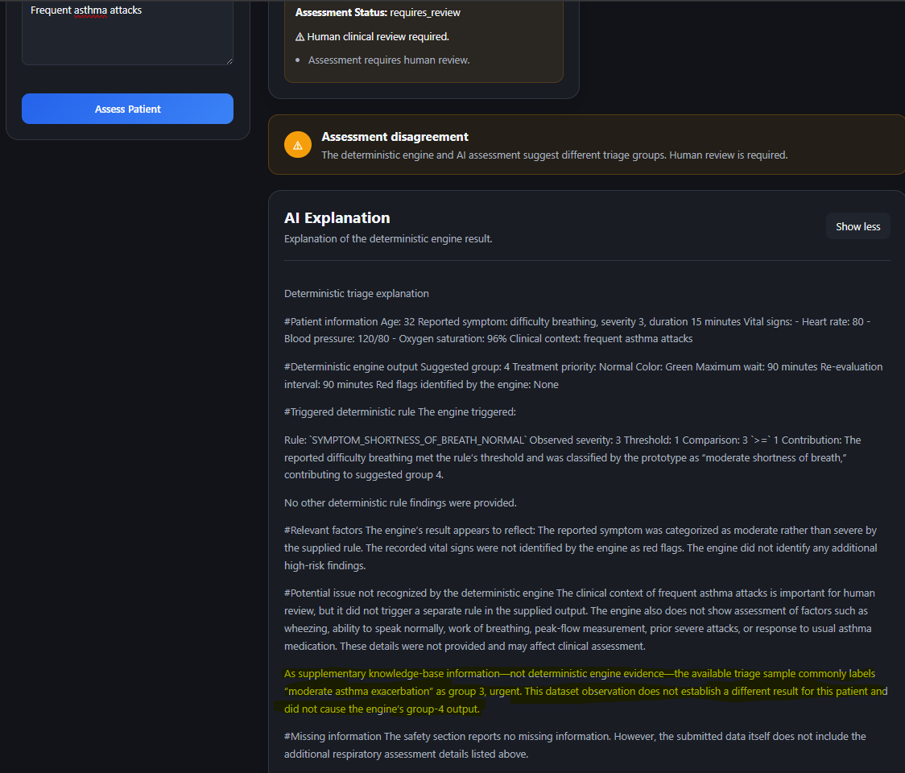

# 🏥 TriageAI

> **An explainable clinical triage decision-support prototype combining
> a deterministic rule-based triage engine with independent AI-assisted
> assessment and supplementary knowledge retrieval.**

Built for the **Munich Hackathon 2026**.

------------------------------------------------------------------------

## ⚠️ Important Disclaimer

TriageAI is a **prototype for clinical decision support**.

It is **not a medical device** and must not be used as a replacement for
professional medical judgment.

The system:

-   Does not diagnose patients
-   Does not prescribe or recommend treatment
-   Does not autonomously make clinical decisions
-   Does not replace healthcare professionals
-   Does not guarantee compliance with the official Manchester Triage
    System

All assessments require **human clinical review**.

------------------------------------------------------------------------

# 🎯 Problem

Clinical triage requires healthcare professionals to rapidly evaluate
patients with different levels of urgency.

Relevant information may include:

-   Patient age
-   Reported symptoms
-   Symptom severity
-   Symptom duration
-   Vital signs
-   Clinical context

Triage decisions must be made using incomplete and potentially complex
information.

TriageAI explores how a combination of:

-   Structured patient data
-   Deterministic and inspectable rules
-   Independent AI-assisted assessment
-   Supplementary knowledge retrieval
-   Explainable output

can support a more transparent clinical decision-support workflow.

------------------------------------------------------------------------

# 🧠 Project Goal

TriageAI deliberately separates its deterministic and AI-assisted
components.

The system currently contains:

1.  A **deterministic rule-based triage engine**
2.  An **independent AI assessment**
3.  An **AI-generated explanation of the deterministic result**
4.  A **supplementary knowledge base available through vector search**

The core architectural principle is:

> **AI output does not override the deterministic triage result.**

The deterministic engine remains responsible for producing the system's
deterministic suggested triage group.

The AI components provide an additional perspective and explanation.

This separation makes it possible to:

-   Inspect deterministic rule findings
-   Identify which rules contributed to a result
-   Produce reproducible deterministic results
-   Compare deterministic and AI-assisted assessments
-   Identify potential information not represented by the current
    deterministic rules
-   Keep supplementary retrieved information separate from deterministic
    evidence

------------------------------------------------------------------------

# ✨ Current Features

## Deterministic Triage Engine

-   Five-level triage priority system
-   Structured patient input
-   Patient age
-   Symptom evaluation
-   Symptom normalization
-   Symptom aliases
-   Symptom severity evaluation
-   Symptom duration evaluation
-   Vital-sign evaluation
-   Red-flag evaluation
-   Missing-information detection
-   Structured rule findings
-   Triggered-rule reporting
-   Relevant-factor reporting
-   Priority resolution
-   Protocol name and version information
-   Human-review requirement

## AI-Assisted Components

-   Independent AI-assisted assessment
-   Separate AI-generated reasoning
-   AI explanation of the deterministic result
-   AI and deterministic assessment comparison
-   Safety restrictions preventing AI from overriding the deterministic
    result
-   Structured validation of AI assessment output

## Supplementary Knowledge Retrieval

TriageAI supports a vector-store-backed knowledge base.

The current vector store contains the content of:

``` text
dataset/clinical-triage-sample-2026.txt
```


When a vector store is configured, it is made available to the AI
components through file search.

The knowledge base is intended to provide **supplementary context**.

It is not part of the deterministic rule engine.

Retrieved information:

-   Does not trigger deterministic rules
-   Does not change deterministic rule findings
-   Does not change the deterministic triage group
-   Does not constitute a diagnosis
-   Must be distinguished from deterministic engine evidence

The knowledge base is used when relevant information may improve the
assessment or explanation.

------------------------------------------------------------------------

# 🏗️ Architecture

``` text
                         ┌────────────────────┐
                         │   USER / CLINICIAN │
                         └─────────┬──────────┘
                                   │
                                   ▼
                    ┌──────────────────────────┐
                    │  STRUCTURED PATIENT DATA │
                    │                          │
                    │ • Age                    │
                    │ • Symptoms               │
                    │ • Severity               │
                    │ • Duration               │
                    │ • Vital signs            │
                    │ • Clinical context       │
                    └────────────┬─────────────┘
                                 │
                                 ▼
                    ┌──────────────────────────┐
                    │    DATA VALIDATION       │
                    └────────────┬─────────────┘
                                 │
                  ┌──────────────┴──────────────┐
                  │                             │
                  ▼                             ▼
       ┌──────────────────────┐      ┌──────────────────────┐
       │ DETERMINISTIC ENGINE │      │  AI-ASSISTED SYSTEM  │
       │                      │      │                      │
       │ • Symptom rules      │      │ • Independent        │
       │ • Vital-sign rules   │      │   assessment         │
       │ • Red flags          │      │ • AI reasoning       │
       │ • Missing information│      │ • AI explanation     │
       │ • Priority resolution│      │                      │
       └──────────┬───────────┘      └──────────┬───────────┘
                  │                             │
                  ▼                             ▼
       ┌──────────────────────┐      ┌──────────────────────┐
       │ DETERMINISTIC RESULT │      │ VECTOR-STORE SEARCH  │
       │                      │      │    WHEN AVAILABLE    │
       └──────────┬───────────┘      └──────────┬───────────┘
                  │                             │
                  └──────────────┬──────────────┘
                                 │
                                 ▼
                    ┌──────────────────────────┐
                    │    RESULT PRESENTATION   │
                    │                          │
                    │ • Deterministic result   │
                    │ • AI assessment          │
                    │ • Comparison             │
                    │ • AI explanation         │
                    │ • Safety information     │
                    └────────────┬─────────────┘
                                 │
                                 ▼
                    ┌──────────────────────────┐
                    │   HUMAN CLINICAL REVIEW  │
                    └──────────────────────────┘
```

------------------------------------------------------------------------

# 🔄 How an Assessment Works

``` text
1. Patient information is submitted
              ↓
2. Structured input is validated
              ↓
3. Deterministic triage engine evaluates the data
              ↓
4. Missing information and safety status are evaluated
              ↓
5. Independent AI assessment is generated
              ↓
6. Supplementary knowledge may be retrieved when relevant
              ↓
7. AI explanation explains the deterministic result
              ↓
8. Deterministic and AI assessments are compared
              ↓
9. Results are presented for human review
```

------------------------------------------------------------------------

# 📥 Structured Patient Information

TriageAI accepts structured patient information including:

-   Age
-   Symptoms
-   Symptom severity
-   Symptom duration
-   Heart rate
-   Systolic blood pressure
-   Diastolic blood pressure
-   Oxygen saturation
-   Clinical context

A symptom contains structured information such as:

``` json
{
    "name": "chest pain",
    "severity": 5,
    "duration_minutes": 20
}
```

Severity is represented on a numerical scale:

``` text
1 → lowest severity
10 → highest severity
```

------------------------------------------------------------------------

# ⚙️ Deterministic Triage Engine

The deterministic engine evaluates patient information using predefined
Python rules.

Its purpose is to produce a reproducible and inspectable result.

The engine evaluates categories including:

``` text
Patient Data
     │
     ├── Symptoms
     │     ├── Name normalization
     │     ├── Aliases
     │     ├── Critical symptoms
     │     ├── Very urgent symptoms
     │     ├── Urgent symptoms
     │     ├── Severity
     │     └── Duration
     │
     ├── Vital Signs
     │     ├── Oxygen saturation
     │     ├── Heart rate
     │     └── Blood pressure
     │
     ├── Red Flags
     │
     └── Missing Information
```

------------------------------------------------------------------------

# 🚦 Five-Level Triage System

TriageAI currently uses a five-level priority system:

``` text
Group 1 → Immediate
Group 2 → Very Urgent
Group 3 → Urgent
Group 4 → Normal
Group 5 → Not Urgent
```

The system also associates groups with:

-   Treatment priority
-   Color
-   Maximum wait time
-   Reevaluation interval

Group `1` represents the highest urgency.

Group `5` represents the lowest urgency.

------------------------------------------------------------------------

# 🧾 Rule Findings

The deterministic engine produces structured rule findings.

A finding can contain:

``` text
rule_id
category
description
observed_value
threshold
comparison
suggested_group
```

This information is used to make the deterministic result inspectable
and explainable.

Example:

``` text
Rule:
SYMPTOM_CHEST_PAIN_URGENT

Observed value:
5

Threshold:
5

Comparison:
5 >= 5

Suggested group:
3
```

The exact rule findings depend on the submitted patient data and
currently implemented rules.

------------------------------------------------------------------------

# 🫁 Vital Signs and Red Flags

The deterministic engine evaluates available vital signs.

The current implementation includes evaluation of:

-   Oxygen saturation
-   Heart rate
-   Blood pressure

The engine also contains a separate red-flag evaluation component.

Triggered findings are represented as structured rule findings and can
contribute to priority resolution.

------------------------------------------------------------------------

# ❓ Missing Information

The system evaluates whether important structured information is
missing.

The current missing-information logic checks for information including:

-   Age
-   Symptoms
-   Heart rate
-   Systolic blood pressure
-   Diastolic blood pressure
-   Oxygen saturation

Missing information contributes to the assessment's safety information.

------------------------------------------------------------------------

# 🤖 Independent AI Assessment

TriageAI also generates an independent AI-assisted assessment.

The AI receives structured patient information and produces:

``` json
{
    "severity": 3,
    "reason": "Short explanation based on the available information."
}
```

The returned AI result is validated before being returned by the
service.

> **The AI assessment does not replace or override the deterministic
> engine.**

------------------------------------------------------------------------

# 🔍 Supplementary Knowledge Base

TriageAI supports a vector-store-backed supplementary knowledge base.

The current vector store contains:

``` text
demo/clinical_triage_sample.txt
```

When configured, file search is made available to the AI components.

This applies to:

-   The independent AI assessment
-   The AI explanation component

The AI may use supplementary knowledge when relevant. It is not required
to retrieve information for every request.

## Knowledge-Base Boundaries

The vector store is **not part of the deterministic rule engine**.

``` text
                 DETERMINISTIC ENGINE
                         │
                         ▼
                DETERMINISTIC RESULT
                         │
                         │ Cannot be modified
                         ▼
                ┌─────────────────┐
                │ AI COMPONENTS   │
                └────────┬────────┘
                         │
                         ▼
                SUPPLEMENTARY
                KNOWLEDGE SEARCH
                         │
                         ▼
                 AI OBSERVATIONS
```

Retrieved information must not be represented as:

-   A triggered deterministic rule
-   A deterministic rule finding
-   A deterministic engine decision
-   A diagnosis

Supplementary information does not alter the deterministic triage group.

------------------------------------------------------------------------

# 🧠 AI Explanation

The AI explanation component explains the deterministic engine result.

It uses structured context including:

``` text
Patient Data

Deterministic Engine Result
├── Protocol information
├── Suggested group
├── Treatment priority
├── Color
├── Wait information
├── Rule findings
├── Triggered rules
├── Red flags
└── Relevant factors

Safety Information
├── Missing information
├── Assessment status
├── Safety warnings
└── Human-review requirement
```

The explanation is intended to clarify:

-   What patient information was provided
-   Which deterministic rules were triggered
-   Why structured rules were triggered
-   How findings contributed to the deterministic result
-   Relevant factors
-   Missing information
-   Safety warnings

------------------------------------------------------------------------

# ⚠️ Potential Issues Not Recognized by the Deterministic Engine

The AI explanation component may identify potentially relevant
information that does not appear to have triggered a deterministic rule.

Such observations must be clearly labelled:

> **Potential issue not recognized by the deterministic engine.**

This does **not** mean that:

-   A diagnosis was made
-   An additional deterministic rule was triggered
-   The AI changed the deterministic result

Instead, this mechanism is intended to support:

-   Human clinical review
-   Identification of potential gaps in the deterministic rule system
-   Future deterministic rule development

------------------------------------------------------------------------

# 🔒 Why the AI Cannot Override the Engine

The deterministic engine and AI are intentionally separated.

``` text
Patient Data
      │
      ├──────────────────────┐
      │                      │
      ▼                      ▼
Deterministic Engine      AI Assessment
      │                      │
      ▼                      ▼
Deterministic Result      Supplementary Result
      │                      │
      └──────────┬───────────┘
                 │
                 ▼
            Comparison
                 │
                 ▼
          Human Review
```

The AI does not:

-   Modify deterministic rules
-   Trigger deterministic rules
-   Change rule findings
-   Override the deterministic triage group
-   Become the authoritative deterministic result

------------------------------------------------------------------------

# 🔀 Assessment Comparison

The frontend compares:

``` text
Deterministic Suggested Group

vs.

Independent AI Suggested Group
```

If both values match:

``` text
Both assessments align
```

If they differ:

``` text
Assessment disagreement
Human review is required.
```

The comparison is informational.

A disagreement does not automatically modify either assessment.

------------------------------------------------------------------------

# 🌐 Backend API

TriageAI uses a FastAPI backend.

The application provides the backend API and interactive documentation.

When running locally:

``` text
Swagger UI
http://localhost:8000/docs
```

``` text
ReDoc
http://localhost:8000/redoc
```

------------------------------------------------------------------------

# ⚛️ Frontend

The frontend is built with React and Vite.

The main interface contains:

``` text
Patient Assessment
│
├── Patient Information
│   └── Age
│
├── Symptoms
│   ├── Name
│   ├── Severity
│   └── Duration
│
├── Vital Signs
│   ├── Heart Rate
│   ├── Oxygen Saturation
│   ├── Systolic BP
│   └── Diastolic BP
│
└── Clinical Context
```

After submission, the frontend displays:

``` text
Triage Assessment
│
├── Triage Result
│   ├── Suggested Group
│   ├── Rule Findings
│   ├── Triggered Rules
│   ├── Relevant Factors
│   └── Safety Information
│
├── AI Assessment
│   ├── Suggested Group
│   └── AI Reasoning
│
├── Assessment Comparison
│
└── AI Explanation
```

------------------------------------------------------------------------

# 🐳 Docker

TriageAI uses Docker Compose to run:

``` text
TriageAI
│
├── Frontend
│   └── Port 5173
│
└── Backend
    └── Port 8000
```

The frontend depends on the backend container.

------------------------------------------------------------------------

# 🚀 Quick Start

## Prerequisites

You need:

-   Docker Desktop
-   Git
-   The required AI service credentials

Make sure Docker Desktop is running before starting the project.

## 1. Clone the Repository

``` bash
git clone https://github.com/tobichie/TriageAI.git
cd TriageAI
```

## 2. Configure Environment Variables

Create a `.env` file in the project root.

Example:

``` env
OPENAI_API_KEY=your_api_key
VECTOR_STORE_ID=your_vector_store_id
```

The vector store can be configured through `VECTOR_STORE_ID`.

If no vector store ID is configured, the service can continue without
attaching the vector-store file-search tool.

> Never commit API keys or secrets to Git.

## 3. Build and Start TriageAI

From the project root:

``` bash
docker compose up -d --build
```

## 4. Check the Containers

``` bash
docker compose ps
```

## 5. Open the Application

Frontend:

``` text
http://localhost:5173
```

Backend API:

``` text
http://localhost:8000
```

Swagger UI:

``` text
http://localhost:8000/docs
```

ReDoc:

``` text
http://localhost:8000/redoc
```

------------------------------------------------------------------------

# 🛑 Stopping TriageAI

``` bash
docker compose down
```

------------------------------------------------------------------------

# 🔄 Rebuilding After Changes

When source files or Docker configuration have changed:

``` bash
docker compose up -d --build
```

------------------------------------------------------------------------

# 📜 Viewing Logs

View logs:

``` bash
docker compose logs
```

Follow logs:

``` bash
docker compose logs -f
```

View backend logs:

``` bash
docker compose logs -f backend
```

View frontend logs:

``` bash
docker compose logs -f frontend
```

------------------------------------------------------------------------

# 📱 Accessing TriageAI From Another Device

The frontend must be able to reach the backend from the device being
used.

For network access, the configured backend address must be reachable
from the device accessing the frontend.

For example:

``` text
http://YOUR_SERVER_IP:8000
```

The FastAPI CORS configuration must also allow the frontend origin.

This is especially important when accessing the application from:

-   A phone
-   Another computer
-   A different host on the local network

------------------------------------------------------------------------

# 🧪 Current Safety Model

TriageAI separates different kinds of information:

``` text
┌──────────────────────────────────────┐
│        PATIENT INFORMATION           │
└──────────────────┬───────────────────┘
                   │
                   ▼
┌──────────────────────────────────────┐
│     DETERMINISTIC RULE ENGINE        │
│                                      │
│ • Reproducible                       │
│ • Inspectable                        │
│ • Rule-based                         │
└──────────────────┬───────────────────┘
                   │
                   ▼
┌──────────────────────────────────────┐
│      DETERMINISTIC RESULT            │
└──────────────────┬───────────────────┘
                   │
                   │ Cannot be overridden
                   ▼
┌──────────────────────────────────────┐
│         AI COMPONENTS                │
│                                      │
│ • Independent assessment             │
│ • Explanation                        │
│ • Supplementary observations         │
└──────────────────┬───────────────────┘
                   │
                   ▼
┌──────────────────────────────────────┐
│   SUPPLEMENTARY KNOWLEDGE BASE       │
│                                      │
│ • Retrieved when relevant            │
│ • Not deterministic evidence         │
└──────────────────────────────────────┘
```

------------------------------------------------------------------------

# 🔒 Security and Reliability Considerations

TriageAI is a prototype.

Important areas for continued improvement include:

-   Input-length restrictions
-   Prompt-injection resistance
-   Authentication and authorization
-   API rate limiting
-   Request logging and monitoring
-   Error handling
-   AI output validation
-   More comprehensive automated testing
-   More comprehensive deterministic rule coverage
-   Validation of knowledge sources
-   Access control for knowledge-base content

These areas should be addressed before considering deployment beyond a
prototype environment.

------------------------------------------------------------------------

# ⚠️ Current Limitations

TriageAI is under active prototype development.

## Prototype Rule Coverage

The deterministic rule system does not represent every possible clinical
presentation.

Absence of a deterministic finding does not mean that a patient
presentation is clinically insignificant.

## Supplementary Knowledge Base

The vector store is supplementary.

It does not replace deterministic rules or professional clinical
judgment.

Retrieved information must not be interpreted as deterministic evidence.

## AI Output

AI output can differ from deterministic output.

The AI is therefore treated as an independent supplementary component
rather than the authoritative deterministic decision-maker.

## Clinical Use

The system is not validated for real-world clinical deployment.

It must not be used as an autonomous triage system.

------------------------------------------------------------------------

# 🧭 Development Philosophy

TriageAI prioritizes:

``` text
Safety
   ↓
Deterministic Transparency
   ↓
Explainability
   ↓
Structured Data
   ↓
AI Assistance
```

The goal is not to allow an AI model to make an opaque clinical
decision.

Instead, the project explores how AI can operate alongside a transparent
deterministic system.

The deterministic engine should remain:

-   Inspectable
-   Testable
-   Reproducible
-   Expandable

AI and retrieved knowledge should remain clearly separated from
deterministic evidence.

------------------------------------------------------------------------

# 🚀 Future Development

Potential future improvements include:

## Deterministic Engine

-   Expanded symptom coverage
-   Expanded vital-sign rules
-   More structured red flags
-   Additional contextual rules
-   Improved rule coverage

## Knowledge Retrieval

-   Expanded and validated knowledge sources
-   Metadata filtering
-   Retrieval evaluation
-   Retrieval quality testing
-   Clearer source attribution

## AI Components

-   Additional AI providers
-   Provider abstraction
-   Improved structured output handling
-   Prompt hardening
-   Evaluation against representative test cases

## Testing

-   Unit tests for individual rules
-   Integration tests
-   API tests
-   Regression tests
-   AI-output validation tests
-   Retrieval tests

## Frontend

-   Improved network configuration
-   Environment-based API configuration
-   Improved error messages
-   Improved assessment history
-   Better source visibility for retrieved supplementary information

------------------------------------------------------------------------

# 🛡️ Core Principle

The central principle of TriageAI is:

> **The deterministic engine produces the deterministic triage result.
> AI assistance and supplementary knowledge retrieval may provide
> additional context, but they do not override that result.**

------------------------------------------------------------------------

# 🏁 Final Disclaimer

TriageAI is a **clinical decision-support prototype created for
experimentation and development**.

It:

-   Does not diagnose patients
-   Does not prescribe treatment
-   Does not make autonomous medical decisions
-   Does not replace healthcare professionals
-   Does not replace professional clinical judgment

**All assessments require human clinical review.**
